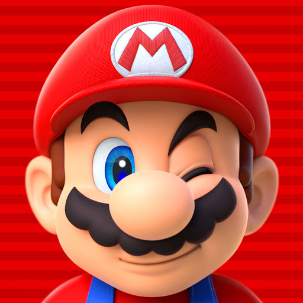

<!--  -->

# Super Mario Runner

 
 

    

This is the Final Project for the course of Interactive Graphics, A.Y. 2022/2023.

>Student:   Giuseppe Prisco `1895709`

## 📚 Libraries used in the Project

-   **THREE.js**: [Official Website 🔗](https://threejs.org/) [[Documentation 🔗](https://threejs.org/docs/)]

    It is a lightweight, cross-browser JavaScript library and application programming interface used to create and display animated 3D computer graphics in a web browser using WebGL.

-   **Tween.js** [Official Website 🔗](https://github.com/tweenjs/tween.js) [[Documentation 🔗](https://github.com/tweenjs/tween.js/blob/main/docs/user_guide.md)]

    It is an open source Javascript tweening engine for creating simple programmatic animations.

## 📜 Project Documentation

-   [Documentation 🔗](./documentation.pdf)

    In this file I present a technical presentation of the project as well as a user manual to explore every aspect of the game.

## 🌐 Browsers

<!-- DOUBLE CHECK  -->
|Browser|Performance|recommended|
|:---|:---|:---:|
|Edge|Good Performance|⭐⭐⭐|
|Chrome|Good Performance|⭐⭐⭐|
|Firefox|Not Very Good Performance|❌|
|Safari|Not Very Good Performance|❌|

## 🎮 Play the game

<b>Game commands</b>

- `A` or `⬅️`: move left
- `D` or `➡️`: move right
- `W` or `⬆️`: jump
- `S` or `⬇️`: slide
- `Space` or `Escape`: pause and resume game

### Play the game at the following link: [https://sapienzainteractivegraphicscourse.github.io/final-project-super-mario-runner/](https://sapienzainteractivegraphicscourse.github.io/final-project-super-mario-runner/)

